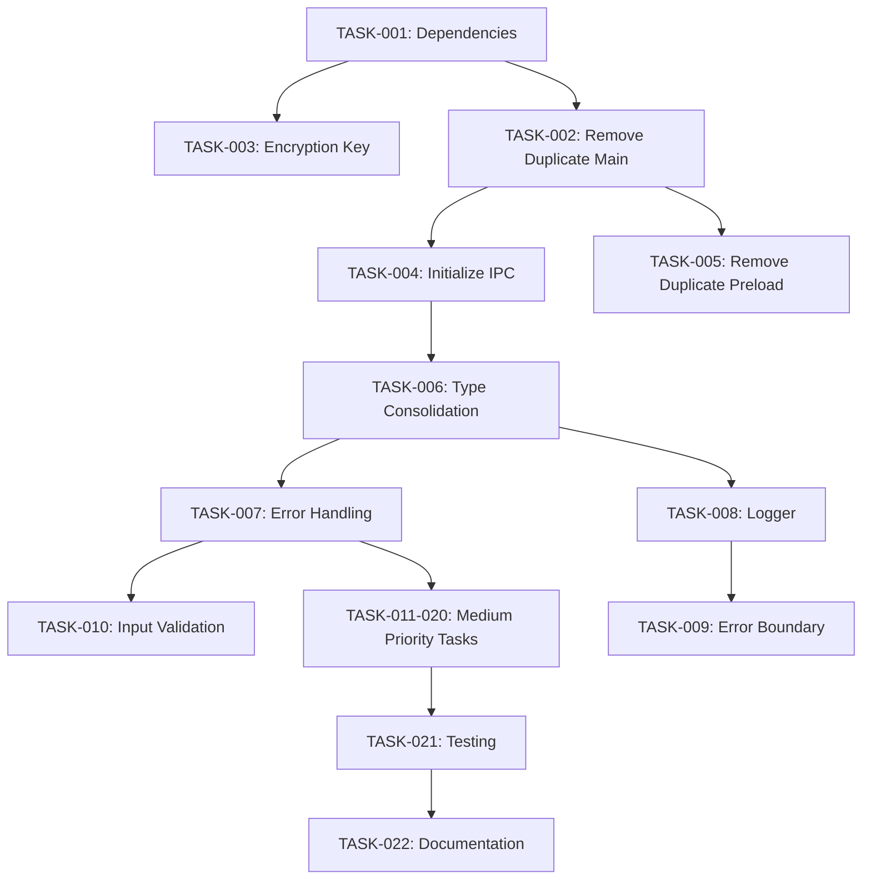

# Smart Pilot Refactoring Plan

**Date**: January 16, 2026
**Version**: 1.0
**Status**: Ready for Implementation

---

## Overview

This document provides a step-by-step refactoring plan to address issues identified in the Code Review Report. Tasks are organized by priority and estimated effort, with clear dependencies between tasks.

---

## Task Priority Legend

- 🔴 **P0 - Critical**: Must fix immediately (production blockers)
- 🟠 **P1 - High**: Should fix within 1 week (quality/maintainability)
- 🟡 **P2 - Medium**: Should fix within 2 weeks (improvements)
- 🟢 **P3 - Low**: Nice to have (polish/optimization)

## Effort Estimation

- **XS**: < 1 hour
- **S**: 1-4 hours
- **M**: 4-8 hours (1 day)
- **L**: 8-24 hours (2-3 days)
- **XL**: 24+ hours (1+ week)

---

## Phase 1: Critical Fixes (Day 1-2)

### TASK-001: Add Missing Dependencies
**Priority**: 🔴 P0
**Effort**: XS (30 min)
**Assigned To**: DevOps/Lead Developer
**Dependencies**: None

**Description**: Add all missing dependencies to package.json

**Implementation**:
```bash
# In project root
npm install --save axios electron-log node-sspi ffi-napi ref-napi ref-struct-napi react-window node-machine-id

# Update package.json versions
```

**Updated package.json**:
```json
{
  "dependencies": {
    "@fluentui/react-components": "^9.47.0",
    "@fluentui/react-icons": "^2.0.228",
    "@pyke/vibe": "^1.0.0",
    "axios": "^1.6.7",
    "electron-log": "^5.0.1",
    "electron-store": "^8.1.0",
    "electron-window-state": "^5.0.3",
    "ffi-napi": "^4.0.3",
    "framer-motion": "^11.0.5",
    "node-machine-id": "^1.1.12",
    "node-sspi": "^0.2.10",
    "react": "^18.2.0",
    "react-dom": "^18.2.0",
    "react-window": "^1.8.10",
    "ref-napi": "^3.0.3",
    "ref-struct-napi": "^1.1.1",
    "ws": "^8.16.0"
  }
}
```

**Verification**:
```bash
npm install
npm run build
# Should compile without errors
```

---

### TASK-002: Remove Duplicate Main Entry Point
**Priority**: 🔴 P0
**Effort**: S (2 hours)
**Assigned To**: Backend Developer
**Dependencies**: None

**Description**: Remove duplicate `src/main/main.ts` and consolidate into `src/main/index.ts`

**Steps**:

1. **Delete** `src/main/main.ts`

2. **Update** `package.json`:
```json
{
  "main": "./dist/main/index.js"
}
```

3. **Verify** `src/main/index.ts` has all necessary functionality:
```typescript
// Ensure these are imported and called:
import { setupAuthHandlers } from './ipc/auth-handlers';
import { setupWebSocketHandlers, enableAutoConnect } from './ipc/websocket-handlers';
import { WindowManager } from './window-manager';
import { TrayManager } from './tray-manager';
```

4. **Update** build scripts in tsconfig.main.json if needed

**Verification**:
```bash
npm run build:main
# Check dist/main/index.js exists
npm start
# App should launch correctly
```

---

### TASK-003: Fix Hardcoded Encryption Key
**Priority**: 🔴 P0 - Security
**Effort**: M (4 hours)
**Assigned To**: Security Engineer / Backend Developer
**Dependencies**: TASK-001 (node-machine-id)

**Description**: Replace hardcoded encryption key with machine-specific key

**Implementation**:

1. **Create** `src/main/utils/crypto.ts`:
```typescript
/**
 * Cryptography utilities for Smart Pilot
 */

import { app } from 'electron';
import { createHash } from 'crypto';
import { machineIdSync } from 'node-machine-id';
import { APP_ID } from '../../shared/constants';

/**
 * Generate a machine-specific encryption key
 * Uses machine ID + user data path + app ID to create unique key per installation
 */
export function generateEncryptionKey(): string {
  try {
    const machineId = machineIdSync({ original: true });
    const userDataPath = app.getPath('userData');
    const seed = `${machineId}-${userDataPath}-${APP_ID}`;

    return createHash('sha256')
      .update(seed)
      .digest('hex');
  } catch (error) {
    console.error('Failed to generate encryption key:', error);
    throw new Error('Could not generate secure encryption key');
  }
}

/**
 * Generate a deterministic key for testing
 * @internal Only for development/testing
 */
export function generateTestEncryptionKey(): string {
  return createHash('sha256')
    .update('smart-pilot-test-key')
    .digest('hex');
}
```

2. **Update** `src/main/auth/auth-service.ts`:
```typescript
import { generateEncryptionKey } from '../utils/crypto';

class SecureTokenStorage implements SecureStorage {
  private store: Store;

  constructor() {
    this.store = new Store({
      name: 'auth-tokens',
      encryptionKey: generateEncryptionKey(), // ✓ Machine-specific
    });
  }

  // ... rest of implementation
}
```

3. **Add** tests for crypto utility:
```typescript
// src/main/utils/__tests__/crypto.test.ts
import { generateEncryptionKey } from '../crypto';

describe('Crypto Utils', () => {
  it('should generate consistent key for same machine', () => {
    const key1 = generateEncryptionKey();
    const key2 = generateEncryptionKey();
    expect(key1).toBe(key2);
  });

  it('should generate 64 character hex string', () => {
    const key = generateEncryptionKey();
    expect(key).toHaveLength(64);
    expect(key).toMatch(/^[0-9a-f]{64}$/);
  });
});
```

**Verification**:
- Run tests: `npm test`
- Test on different machines (encryption keys should differ)
- Verify tokens are encrypted in electron-store file

---

### TASK-004: Initialize All IPC Handlers
**Priority**: 🔴 P0
**Effort**: S (2 hours)
**Assigned To**: Backend Developer
**Dependencies**: TASK-002

**Description**: Ensure all IPC handlers are properly initialized

**Implementation**:

**Update** `src/main/index.ts`:
```typescript
/**
 * Smart Pilot - Main Process Entry Point
 *
 * Electron main process that initializes Windows integration
 */

import { app, BrowserWindow } from 'electron';
import * as path from 'path';
import log from 'electron-log';

// IPC Handlers
import { initializeWindowHandlers, cleanupWindowHandlers } from './ipc/window-handlers';
import { setupAuthHandlers, cleanupAuthHandlers } from './ipc/auth-handlers';
import { setupWebSocketHandlers, enableAutoConnect, cleanupWebSocketHandlers } from './ipc/websocket-handlers';

// Services
import { WindowManager } from './window-manager';
import { TrayManager } from './tray-manager';
import Store from 'electron-store';

let mainWindow: BrowserWindow | null = null;
let windowManager: WindowManager | null = null;
let trayManager: TrayManager | null = null;

/**
 * Initialize application
 */
async function initialize(): Promise<void> {
  log.info('Smart Pilot starting...');
  log.info('Platform:', process.platform);
  log.info('Electron version:', process.versions.electron);

  try {
    // Initialize shared store
    const store = new Store();

    // Initialize IPC handlers (before window creation)
    initializeWindowHandlers();
    setupAuthHandlers();

    // Create window manager and main window
    windowManager = new WindowManager(store);
    mainWindow = windowManager.createMainWindow();

    // Initialize WebSocket handlers (after window creation)
    setupWebSocketHandlers(mainWindow);
    enableAutoConnect();

    // Create tray manager
    trayManager = new TrayManager(windowManager);
    trayManager.createTray();

    log.info('Smart Pilot initialization complete');
  } catch (error) {
    log.error('Failed to initialize Smart Pilot:', error);
    throw error;
  }
}

/**
 * Cleanup application
 */
function cleanup(): void {
  log.info('Smart Pilot shutting down...');

  // Cleanup IPC handlers
  cleanupWindowHandlers();
  cleanupAuthHandlers();
  cleanupWebSocketHandlers();

  // Cleanup managers
  trayManager?.destroy();

  // Cleanup window
  mainWindow = null;
  windowManager = null;
  trayManager = null;

  log.info('Cleanup complete');
}

/**
 * App ready event
 */
app.on('ready', async () => {
  await initialize();
});

/**
 * All windows closed event
 */
app.on('window-all-closed', () => {
  if (process.platform !== 'darwin') {
    app.quit();
  }
});

/**
 * Activate event (macOS)
 */
app.on('activate', async () => {
  if (mainWindow === null) {
    await initialize();
  }
});

/**
 * Before quit event
 */
app.on('before-quit', () => {
  cleanup();
});

/**
 * Handle uncaught exceptions
 */
process.on('uncaughtException', (error) => {
  log.error('Uncaught exception:', error);
});

/**
 * Handle unhandled promise rejections
 */
process.on('unhandledRejection', (reason, promise) => {
  log.error('Unhandled rejection at:', promise, 'reason:', reason);
});
```

**Verification**:
- Start app: `npm start`
- Test auth: Call `window.smartPilot.auth.checkStatus()`
- Test WebSocket: Call `window.smartPilot.ws.getState()`
- Check logs for "Smart Pilot initialization complete"

---

### TASK-005: Remove Duplicate Preload
**Priority**: 🔴 P0
**Effort**: XS (1 hour)
**Assigned To**: Backend Developer
**Dependencies**: TASK-002

**Description**: Remove duplicate `src/main/preload.ts` file

**Steps**:

1. **Delete** `src/main/preload.ts`

2. **Update** window creation in `src/main/window-manager.ts`:
```typescript
webPreferences: {
  preload: path.join(__dirname, '../preload/preload.js'), // ✓ Correct path
  nodeIntegration: false,
  contextIsolation: true,
  sandbox: true,
  webSecurity: true,
  allowRunningInsecureContent: false,
  enableRemoteModule: false,
},
```

3. **Verify** preload path in build output

**Verification**:
```bash
npm run build
# Check that only dist/preload/preload.js exists
# Start app and verify window.smartPilot is available in DevTools
```

---

## Phase 2: High Priority Fixes (Week 1)

### TASK-006: Consolidate Type Definitions
**Priority**: 🟠 P1
**Effort**: L (2 days)
**Assigned To**: TypeScript Developer
**Dependencies**: None

**Description**: Consolidate and organize all type definitions into proper namespaces

**Implementation**:

1. **Create** new type organization structure:

```
src/shared/types/
├── index.ts          # Main export
├── auth.ts           # Authentication types (existing)
├── websocket.ts      # WebSocket types (existing)
├── windows.ts        # Windows integration types (existing)
├── ui.ts             # NEW: UI-specific types
├── ipc.ts            # NEW: IPC types
└── settings.ts       # NEW: Settings types
```

2. **Create** `src/shared/types/ui.ts`:
```typescript
/**
 * UI-specific type definitions for Smart Pilot
 */

export type GhostWindowState = 'hidden' | 'handle' | 'widget' | 'app' | 'fullscreen';

export interface GhostWindowDimensions {
  width: number | string;
  height: number | string;
}

export interface DetectedWindow {
  id: string;
  title: string;
  processName: string;
  icon?: string;
  applicationType: 'browser' | 'desktop' | 'other';
  url?: string;
  isActive: boolean;
}

export interface ConnectionStatus {
  status: 'connecting' | 'connected' | 'disconnected' | 'error';
  message: string;
  lastConnected?: Date;
}

export interface UserInfo {
  name: string;
  email?: string;
  avatar?: string;
}

export type PanelPosition = 'left' | 'right';
```

3. **Create** `src/shared/types/settings.ts`:
```typescript
/**
 * Application settings type definitions
 */

import { PanelPosition, GhostWindowState } from './ui';

export interface GhostInterfaceSettings {
  panelPosition: PanelPosition;
  autoStart: boolean;
  panelHeight: number;
  theme: 'light' | 'dark';
  lastWindowState: GhostWindowState;
}

export interface ElectronWindowSettings {
  theme: 'light' | 'dark' | 'system';
  accentColor: string;
  fontSize: 'small' | 'medium' | 'large';
  startOnBoot: boolean;
  minimizeToTray: boolean;
  enableNotifications: boolean;
  enableAnimations: boolean;
  windowOpacity: number;
  backdropEffect: 'acrylic' | 'mica' | 'none';
}

// Unified settings type
export type AppSettings = GhostInterfaceSettings | ElectronWindowSettings;
```

4. **Create** `src/shared/types/ipc.ts`:
```typescript
/**
 * IPC communication type definitions
 */

export interface IpcResponse<T = any> {
  success: boolean;
  data?: T;
  error?: {
    code: string;
    message: string;
    details?: unknown;
  };
  timestamp?: number;
}

export interface IpcRequest<T = any> {
  channel: string;
  data?: T;
  requestId?: string;
}
```

5. **Update** `src/shared/types/index.ts`:
```typescript
/**
 * Centralized type definitions for Smart Pilot
 *
 * Usage:
 *   import { Auth, WebSocket, Windows, UI, IPC } from '@/shared/types';
 *   const user: Auth.WindowsUser = ...;
 */

// Re-export all types with namespaces
export * as Auth from './auth';
export * as WebSocket from './websocket';
export * as Windows from './windows';
export * as UI from './ui';
export * as IPC from './ipc';
export * as Settings from './settings';

// Export commonly used types directly
export type { WindowsUser, JWTToken, SessionInfo } from './auth';
export type { WebSocketMessage, MessageType } from './websocket';
export type { WindowInfo, BrowserTab, SessionContext } from './windows';
export type { GhostWindowState, DetectedWindow, ConnectionStatus } from './ui';
export type { IpcResponse, IpcRequest } from './ipc';
export type { AppSettings } from './settings';
```

6. **Update** `src/shared/types.ts` to re-export:
```typescript
/**
 * Legacy type exports for backward compatibility
 * @deprecated Import from '@/shared/types' instead
 */

export * from './types/index';

// IPC Channel constants
export const IPC_CHANNELS = {
  // Window management
  WINDOW_MINIMIZE: 'window:minimize',
  WINDOW_MAXIMIZE: 'window:maximize',
  WINDOW_CLOSE: 'window:close',
  WINDOW_RESTORE: 'window:restore',
  WINDOW_GET_STATE: 'window:get-state',
  WINDOW_SET_BOUNDS: 'window:set-bounds',

  // Settings
  SETTINGS_GET: 'settings:get',
  SETTINGS_SET: 'settings:set',
  SETTINGS_RESET: 'settings:reset',

  // System tray
  TRAY_SHOW: 'tray:show',
  TRAY_HIDE: 'tray:hide',
  TRAY_UPDATE_MENU: 'tray:update-menu',

  // WebSocket
  WS_CONNECT: 'ws:connect',
  WS_DISCONNECT: 'ws:disconnect',
  WS_SEND: 'ws:send',
  WS_STATUS: 'ws:status',

  // Notifications
  NOTIFICATION_SHOW: 'notification:show',

  // System integration
  SYSTEM_GET_INFO: 'system:get-info',
  SYSTEM_GET_ACTIVE_WINDOW: 'system:get-active-window',

  // File operations
  FILE_OPEN_DIALOG: 'file:open-dialog',
  FILE_SAVE_DIALOG: 'file:save-dialog',
} as const;

// SmartPilotAPI interface
export interface SmartPilotAPI {
  // ... (keep existing SmartPilotAPI definition)
}
```

7. **Update all imports** across the codebase:
```typescript
// OLD:
import { WindowsUser } from '../../shared/types/auth';
import { WebSocketMessage } from '../../shared/types/websocket';

// NEW:
import { Auth, WebSocket } from '../../shared/types';

const user: Auth.WindowsUser = ...;
const message: WebSocket.WebSocketMessage = ...;
```

**Verification**:
- Run type check: `npm run type-check`
- Verify no type errors
- Check that imports resolve correctly
- Build project: `npm run build`

**Estimated Files to Update**: ~30 files

---

### TASK-007: Standardize Error Handling
**Priority**: 🟠 P1
**Effort**: M (1 day)
**Assigned To**: Backend Developer
**Dependencies**: TASK-006

**Description**: Create unified error handling utility and apply across IPC handlers

**Implementation**:

1. **Create** `src/shared/utils/error-handler.ts`:
```typescript
/**
 * Unified error handling utilities for Smart Pilot
 */

import { IPC } from '../types';

/**
 * Custom error class for IPC operations
 */
export class IpcError extends Error {
  constructor(
    public readonly code: string,
    message: string,
    public readonly details?: unknown
  ) {
    super(message);
    this.name = 'IpcError';
    Object.setPrototypeOf(this, IpcError.prototype);
  }
}

/**
 * Standard IPC error codes
 */
export const IPC_ERROR_CODES = {
  // Generic
  UNKNOWN_ERROR: 'UNKNOWN_ERROR',
  INVALID_INPUT: 'INVALID_INPUT',
  NOT_INITIALIZED: 'NOT_INITIALIZED',

  // Window errors
  WINDOW_NOT_FOUND: 'WINDOW_NOT_FOUND',
  ENUM_WINDOWS_ERROR: 'ENUM_WINDOWS_ERROR',
  GET_ACTIVE_WINDOW_ERROR: 'GET_ACTIVE_WINDOW_ERROR',

  // Auth errors
  AUTH_FAILED: 'AUTH_FAILED',
  TOKEN_EXPIRED: 'TOKEN_EXPIRED',
  TOKEN_REFRESH_FAILED: 'TOKEN_REFRESH_FAILED',

  // WebSocket errors
  WS_NOT_CONNECTED: 'WS_NOT_CONNECTED',
  WS_CONNECTION_FAILED: 'WS_CONNECTION_FAILED',
  WS_SEND_FAILED: 'WS_SEND_FAILED',
} as const;

/**
 * Convert any error to IPC response format
 */
export function handleIpcError<T = never>(error: unknown): IPC.IpcResponse<T> {
  if (error instanceof IpcError) {
    return {
      success: false,
      error: {
        code: error.code,
        message: error.message,
        details: error.details,
      },
      timestamp: Date.now(),
    };
  }

  if (error instanceof Error) {
    return {
      success: false,
      error: {
        code: IPC_ERROR_CODES.UNKNOWN_ERROR,
        message: error.message,
        details: {
          name: error.name,
          stack: error.stack,
        },
      },
      timestamp: Date.now(),
    };
  }

  return {
    success: false,
    error: {
      code: IPC_ERROR_CODES.UNKNOWN_ERROR,
      message: 'An unknown error occurred',
      details: error,
    },
    timestamp: Date.now(),
  };
}

/**
 * Create successful IPC response
 */
export function createSuccessResponse<T>(data: T): IPC.IpcResponse<T> {
  return {
    success: true,
    data,
    timestamp: Date.now(),
  };
}

/**
 * Wrap async IPC handler with error handling
 */
export function wrapIpcHandler<T>(
  handler: () => Promise<T>
): Promise<IPC.IpcResponse<T>> {
  return handler()
    .then(createSuccessResponse)
    .catch(handleIpcError);
}
```

2. **Update** `src/main/ipc/auth-handlers.ts`:
```typescript
import { wrapIpcHandler, IpcError, IPC_ERROR_CODES } from '../../shared/utils/error-handler';
import { IPC } from '../../shared/types';

ipcMain.handle('windows-auth-login', async (): Promise<IPC.IpcResponse<any>> => {
  return wrapIpcHandler(async () => {
    log.info('IPC: windows-auth-login called');

    const result = await authService.login();

    if (result.success) {
      const status = authService.getAuthStatus();
      log.info('Login successful:', status.user?.username);
      return {
        success: true,
        user: status.user,
        tokenExpiresIn: status.tokenExpiresIn,
      };
    }

    throw new IpcError(
      IPC_ERROR_CODES.AUTH_FAILED,
      result.error || 'Authentication failed'
    );
  });
});
```

3. **Update** `src/main/ipc/websocket-handlers.ts`:
```typescript
import { wrapIpcHandler, IpcError, IPC_ERROR_CODES } from '../../shared/utils/error-handler';

ipcMain.handle('ws-send-message', async (event, type, payload, correlationId) => {
  return wrapIpcHandler(async () => {
    if (!wsClient) {
      throw new IpcError(
        IPC_ERROR_CODES.WS_NOT_CONNECTED,
        'WebSocket not initialized'
      );
    }

    wsClient.send(type, payload, correlationId);
    return { sent: true };
  });
});
```

4. **Update** `src/main/ipc/window-handlers.ts`:
```typescript
import { wrapIpcHandler, createSuccessResponse, handleIpcError } from '../../shared/utils/error-handler';

private async handleGetAllWindows(event: IpcMainInvokeEvent): Promise<IPC.IpcResponse<WindowsDetectionResult>> {
  return wrapIpcHandler(async () => {
    console.log('IPC: get-all-windows requested');
    return await this.windowDetector.getAllWindows();
  });
}
```

**Verification**:
- Test all IPC handlers return consistent response format
- Verify error responses include code, message, timestamp
- Check error logging works correctly

**Estimated Files to Update**: ~10 IPC handler files

---

### TASK-008: Create Centralized Logger
**Priority**: 🟠 P1
**Effort**: S (3 hours)
**Assigned To**: DevOps / Backend Developer
**Dependencies**: None

**Description**: Replace all console.log with centralized logger using electron-log

**Implementation**:

1. **Create** `src/shared/utils/logger.ts`:
```typescript
/**
 * Centralized logging utility for Smart Pilot
 * Wraps electron-log for consistent logging across main and renderer processes
 */

import log from 'electron-log';
import { app } from 'electron';

// Configure electron-log
log.transports.file.level = 'info';
log.transports.console.level = 'debug';

// Set log file location
if (app) {
  log.transports.file.resolvePathFn = () =>
    path.join(app.getPath('userData'), 'logs', 'smart-pilot.log');
}

/**
 * Logger instance with structured logging
 */
export class Logger {
  constructor(private context: string) {}

  debug(message: string, ...args: any[]): void {
    log.debug(`[${this.context}]`, message, ...args);
  }

  info(message: string, ...args: any[]): void {
    log.info(`[${this.context}]`, message, ...args);
  }

  warn(message: string, ...args: any[]): void {
    log.warn(`[${this.context}]`, message, ...args);
  }

  error(message: string, error?: Error | unknown, ...args: any[]): void {
    if (error instanceof Error) {
      log.error(`[${this.context}]`, message, {
        error: error.message,
        stack: error.stack,
        ...args,
      });
    } else {
      log.error(`[${this.context}]`, message, error, ...args);
    }
  }

  /**
   * Log function entry (for debugging)
   */
  entry(functionName: string, params?: any): void {
    this.debug(`→ ${functionName}`, params);
  }

  /**
   * Log function exit (for debugging)
   */
  exit(functionName: string, result?: any): void {
    this.debug(`← ${functionName}`, result);
  }
}

/**
 * Create logger instance for a specific context
 */
export function createLogger(context: string): Logger {
  return new Logger(context);
}

// Export default logger
export const logger = log;
```

2. **Update all files** to use logger:

```typescript
// src/main/index.ts
import { createLogger } from '../shared/utils/logger';

const logger = createLogger('Main');

app.on('ready', () => {
  logger.info('Smart Pilot starting...');
  logger.info('Platform:', process.platform);
  logger.info('Electron version:', process.versions.electron);
});

// src/main/auth/auth-service.ts
import { createLogger } from '../../shared/utils/logger';

const logger = createLogger('AuthService');

async function login(): Promise<{ success: boolean; error?: string }> {
  logger.entry('login');
  try {
    const result = await this.authenticator.authenticateWithWindowsUser();
    logger.info('Login successful');
    return { success: true };
  } catch (error) {
    logger.error('Login failed', error);
    return { success: false, error: error.message };
  }
}

// src/main/ipc/window-handlers.ts
import { createLogger } from '../../shared/utils/logger';

const logger = createLogger('WindowHandlers');

private async handleGetAllWindows(event: IpcMainInvokeEvent) {
  logger.debug('IPC: get-all-windows requested');
  try {
    const result = await this.windowDetector.getAllWindows();
    logger.info('Windows enumerated:', result.totalCount);
    return createSuccessResponse(result);
  } catch (error) {
    logger.error('Failed to enumerate windows', error);
    return handleIpcError(error);
  }
}
```

3. **Remove all `console.log`** statements:
```bash
# Find all console.log usage
grep -r "console\." src/ --include="*.ts" --include="*.tsx"

# Replace manually in each file
```

**Verification**:
- Check logs are written to `%APPDATA%/smart-pilot/logs/smart-pilot.log`
- Verify log levels work correctly (debug, info, warn, error)
- Test log rotation

**Estimated Files to Update**: ~40 files

---

### TASK-009: Add React Error Boundary
**Priority**: 🟠 P1
**Effort**: S (2 hours)
**Assigned To**: Frontend Developer
**Dependencies**: TASK-008

**Description**: Implement Error Boundary to catch and handle React errors

**Implementation**:

1. **Create** `src/renderer/components/ErrorBoundary.tsx`:
```typescript
/**
 * Error Boundary Component
 * Catches and handles React errors gracefully
 */

import React from 'react';
import { Button, Card } from '@fluentui/react-components';
import { ErrorCircle24Filled, ArrowReset24Regular } from '@fluentui/react-icons';
import { themeTokens } from '../styles/theme';
import { createLogger } from '../../shared/utils/logger';

const logger = createLogger('ErrorBoundary');

interface Props {
  children: React.ReactNode;
  fallback?: React.ReactNode;
}

interface State {
  hasError: boolean;
  error?: Error;
  errorInfo?: React.ErrorInfo;
}

export class ErrorBoundary extends React.Component<Props, State> {
  constructor(props: Props) {
    super(props);
    this.state = { hasError: false };
  }

  static getDerivedStateFromError(error: Error): State {
    return { hasError: true, error };
  }

  componentDidCatch(error: Error, errorInfo: React.ErrorInfo): void {
    logger.error('React component error caught:', error, {
      componentStack: errorInfo.componentStack,
    });

    this.setState({
      error,
      errorInfo,
    });
  }

  handleReset = (): void => {
    this.setState({ hasError: false, error: undefined, errorInfo: undefined });
  };

  handleReload = (): void => {
    window.location.reload();
  };

  render(): React.ReactNode {
    if (this.state.hasError) {
      if (this.props.fallback) {
        return this.props.fallback;
      }

      return (
        <div
          style={{
            display: 'flex',
            alignItems: 'center',
            justifyContent: 'center',
            height: '100vh',
            width: '100vw',
            background: themeTokens.colors.grayDark,
            padding: '20px',
          }}
        >
          <Card
            style={{
              maxWidth: '600px',
              padding: '32px',
              background: themeTokens.colors.grayMedium,
              border: `2px solid ${themeTokens.colors.orange}`,
            }}
          >
            <div style={{ display: 'flex', alignItems: 'center', gap: '16px', marginBottom: '24px' }}>
              <ErrorCircle24Filled
                primaryFill={themeTokens.colors.orange}
                style={{ fontSize: '48px' }}
              />
              <div>
                <h1 style={{ color: 'white', fontSize: '24px', margin: 0 }}>
                  Something went wrong
                </h1>
                <p style={{ color: themeTokens.colors.grayLight, margin: '8px 0 0' }}>
                  The application encountered an unexpected error
                </p>
              </div>
            </div>

            {this.state.error && (
              <div
                style={{
                  background: 'rgba(0, 0, 0, 0.2)',
                  padding: '16px',
                  borderRadius: '8px',
                  marginBottom: '24px',
                }}
              >
                <p style={{ color: themeTokens.colors.orange, fontWeight: 600, margin: '0 0 8px' }}>
                  Error Details:
                </p>
                <p style={{ color: 'white', fontFamily: 'monospace', fontSize: '12px', margin: 0 }}>
                  {this.state.error.message}
                </p>
                {process.env.NODE_ENV === 'development' && this.state.errorInfo && (
                  <details style={{ marginTop: '12px' }}>
                    <summary style={{ color: themeTokens.colors.grayLight, cursor: 'pointer' }}>
                      Component Stack
                    </summary>
                    <pre
                      style={{
                        color: themeTokens.colors.grayLight,
                        fontSize: '10px',
                        overflow: 'auto',
                        marginTop: '8px',
                      }}
                    >
                      {this.state.errorInfo.componentStack}
                    </pre>
                  </details>
                )}
              </div>
            )}

            <div style={{ display: 'flex', gap: '12px' }}>
              <Button
                appearance="primary"
                icon={<ArrowReset24Regular />}
                onClick={this.handleReset}
                style={{ flex: 1 }}
              >
                Try Again
              </Button>
              <Button
                appearance="secondary"
                onClick={this.handleReload}
                style={{ flex: 1 }}
              >
                Reload Application
              </Button>
            </div>
          </Card>
        </div>
      );
    }

    return this.props.children;
  }
}
```

2. **Update** `src/renderer/main.tsx`:
```typescript
import React from 'react';
import ReactDOM from 'react-dom/client';
import App from './App';
import { ErrorBoundary } from './components/ErrorBoundary';

const root = document.getElementById('root');

if (!root) {
  throw new Error('Root element not found');
}

ReactDOM.createRoot(root).render(
  <React.StrictMode>
    <ErrorBoundary>
      <App />
    </ErrorBoundary>
  </React.StrictMode>
);
```

3. **Add tests** for Error Boundary:
```typescript
// src/renderer/components/__tests__/ErrorBoundary.test.tsx
import { render } from '@testing-library/react';
import { ErrorBoundary } from '../ErrorBoundary';

const ThrowError = () => {
  throw new Error('Test error');
};

describe('ErrorBoundary', () => {
  it('should render children when no error', () => {
    const { getByText } = render(
      <ErrorBoundary>
        <div>Test content</div>
      </ErrorBoundary>
    );
    expect(getByText('Test content')).toBeInTheDocument();
  });

  it('should render error UI when error occurs', () => {
    const { getByText } = render(
      <ErrorBoundary>
        <ThrowError />
      </ErrorBoundary>
    );
    expect(getByText('Something went wrong')).toBeInTheDocument();
  });
});
```

**Verification**:
- Test by throwing error in a component
- Verify error UI displays correctly
- Check logs contain error details
- Test "Try Again" and "Reload" buttons

---

### TASK-010: Add Input Validation for IPC
**Priority**: 🟠 P1
**Effort**: M (6 hours)
**Assigned To**: Backend Developer
**Dependencies**: TASK-007

**Description**: Add input validation to all IPC handlers using Zod

**Implementation**:

1. **Install Zod**:
```bash
npm install --save zod
```

2. **Create** `src/shared/schemas/ipc-schemas.ts`:
```typescript
/**
 * Zod schemas for IPC input validation
 */

import { z } from 'zod';

// WebSocket schemas
export const SendMessageSchema = z.object({
  type: z.string().min(1, 'Message type is required'),
  payload: z.unknown(),
  correlationId: z.string().optional(),
});

export const CancelOperationSchema = z.object({
  operationId: z.string().min(1, 'Operation ID is required'),
  reason: z.string().optional(),
});

// Window schemas
export const GetWindowsByProcessSchema = z.object({
  processName: z.string().min(1, 'Process name is required'),
});

export const GetWindowsByClassSchema = z.object({
  className: z.string().min(1, 'Class name is required'),
});

// Settings schemas
export const SetSettingSchema = z.object({
  key: z.string().min(1, 'Setting key is required'),
  value: z.unknown(),
});

// WebSocket connection config schema
export const WebSocketConfigSchema = z.object({
  url: z.string().url('Invalid WebSocket URL'),
  autoReconnect: z.boolean().optional(),
  reconnectInterval: z.number().positive().optional(),
  maxReconnectInterval: z.number().positive().optional(),
  pingInterval: z.number().positive().optional(),
  pongTimeout: z.number().positive().optional(),
  connectionTimeout: z.number().positive().optional(),
}).optional();
```

3. **Create validation utility**:
```typescript
// src/shared/utils/validation.ts
import { z } from 'zod';
import { IpcError, IPC_ERROR_CODES } from './error-handler';

export function validateInput<T>(schema: z.ZodSchema<T>, input: unknown): T {
  try {
    return schema.parse(input);
  } catch (error) {
    if (error instanceof z.ZodError) {
      throw new IpcError(
        IPC_ERROR_CODES.INVALID_INPUT,
        'Invalid input parameters',
        error.errors
      );
    }
    throw error;
  }
}
```

4. **Update IPC handlers** with validation:

```typescript
// src/main/ipc/websocket-handlers.ts
import { SendMessageSchema, WebSocketConfigSchema } from '../../shared/schemas/ipc-schemas';
import { validateInput } from '../../shared/utils/validation';

ipcMain.handle('ws-send-message', async (event, type, payload, correlationId) => {
  return wrapIpcHandler(async () => {
    // Validate input
    const validated = validateInput(SendMessageSchema, {
      type,
      payload,
      correlationId,
    });

    if (!wsClient) {
      throw new IpcError(IPC_ERROR_CODES.WS_NOT_CONNECTED, 'WebSocket not initialized');
    }

    wsClient.send(validated.type, validated.payload, validated.correlationId);
    return { success: true };
  });
});

ipcMain.handle('ws-connect', async (event, config) => {
  return wrapIpcHandler(async () => {
    // Validate config
    const validatedConfig = validateInput(WebSocketConfigSchema, config);

    // Get access token
    const authService = getAuthService();
    const token = authService.getAccessToken();

    if (!token) {
      throw new IpcError(IPC_ERROR_CODES.AUTH_FAILED, 'Not authenticated');
    }

    // Create WebSocket client
    if (!wsClient) {
      wsClient = new WebSocketClient({
        url: validatedConfig?.url || 'ws://localhost:8000/ws',
        token,
        ...validatedConfig,
      });

      setupWebSocketEventHandlers();
    }

    await wsClient.connect(token);
    logger.info('WebSocket connected');

    return { success: true };
  });
});
```

**Verification**:
- Test with invalid inputs (should return validation errors)
- Test with valid inputs (should work normally)
- Verify error messages are descriptive
- Check performance impact is minimal

**Estimated Files to Update**: ~10 IPC handler files

---

## Phase 3: Medium Priority Improvements (Week 2)

### TASK-011: Extract Duplicate Store Logic
**Priority**: 🟡 P2
**Effort**: S (2 hours)
**Assigned To**: Frontend Developer
**Dependencies**: None

**Implementation**:

**Create** `src/renderer/utils/store.ts`:
```typescript
/**
 * Store utility for renderer process
 * Provides unified access to electron-store or localStorage fallback
 */

interface StoreAPI {
  get<T>(key: string, defaultValue: T): T;
  set(key: string, value: any): void;
  delete(key: string): void;
  has(key: string): boolean;
}

class BrowserStore implements StoreAPI {
  get<T>(key: string, defaultValue: T): T {
    try {
      const stored = localStorage.getItem(key);
      return stored ? JSON.parse(stored) : defaultValue;
    } catch {
      return defaultValue;
    }
  }

  set(key: string, value: any): void {
    try {
      localStorage.setItem(key, JSON.stringify(value));
    } catch (error) {
      console.error('Failed to save to localStorage:', error);
    }
  }

  delete(key: string): void {
    try {
      localStorage.removeItem(key);
    } catch (error) {
      console.error('Failed to delete from localStorage:', error);
    }
  }

  has(key: string): boolean {
    return localStorage.getItem(key) !== null;
  }
}

/**
 * Get store instance
 * Uses electron-store if available, falls back to localStorage
 */
export function createStore(): StoreAPI {
  if (typeof window !== 'undefined' && window.electronStore) {
    return window.electronStore;
  }

  return new BrowserStore();
}

// Singleton instance
let storeInstance: StoreAPI | null = null;

export function getStore(): StoreAPI {
  if (!storeInstance) {
    storeInstance = createStore();
  }
  return storeInstance;
}
```

**Update components**:
```typescript
// src/renderer/hooks/useWindowState.ts
import { getStore } from '../utils/store';

export const useWindowState = (): UseWindowStateReturn => {
  const store = getStore();
  // ... rest of implementation
};

// src/renderer/components/SettingsPanel.tsx
import { getStore } from '../utils/store';

const SettingsPanel: React.FC<SettingsPanelProps> = ({ onClose }) => {
  const store = getStore();
  // ... rest of implementation
};
```

---

### TASK-012: Centralize Constants
**Priority**: 🟡 P2
**Effort**: S (3 hours)
**Assigned To**: Any Developer
**Dependencies**: None

**Implementation**:

**Create** `src/shared/constants/window-dimensions.ts`:
```typescript
/**
 * Window dimension constants for Ghost Interface
 */

export const WINDOW_DIMENSIONS = {
  HIDDEN: {
    width: 0,
    height: 0,
  },
  HANDLE: {
    width: 8,
    heightPercent: 100, // Percentage of screen height
  },
  WIDGET: {
    width: 200,
    height: 200,
  },
  APP: {
    width: 400,
    height: 800,
  },
  FULLSCREEN: {
    widthPercent: 100,
    heightPercent: 100,
  },
} as const;
```

**Update** `src/shared/constants/index.ts`:
```typescript
export * from './window-dimensions';
export * from '../constants'; // Existing constants
```

**Update usage**:
```typescript
// src/main/main.ts (if not deleted)
import { WINDOW_DIMENSIONS } from '../shared/constants/window-dimensions';

const getWindowDimensions = (state: string): WindowStateDimensions => {
  const display = screen.getPrimaryDisplay();
  const { width: screenWidth, height: screenHeight } = display.workAreaSize;

  switch (state) {
    case 'hidden':
      return WINDOW_DIMENSIONS.HIDDEN;
    case 'handle':
      return {
        width: WINDOW_DIMENSIONS.HANDLE.width,
        height: screenHeight,
      };
    case 'widget':
      return WINDOW_DIMENSIONS.WIDGET;
    case 'app':
      return WINDOW_DIMENSIONS.APP;
    case 'fullscreen':
      return { width: screenWidth, height: screenHeight };
    default:
      return {
        width: WINDOW_DIMENSIONS.HANDLE.width,
        height: screenHeight,
      };
  }
};
```

---

### TASK-013 to TASK-020: Additional Medium Priority Tasks

Due to length constraints, here's a summary of remaining medium priority tasks:

- **TASK-013**: Add TypeScript strict mode (M effort)
- **TASK-014**: Optimize React re-renders with memo/useMemo (M effort)
- **TASK-015**: Add JSDoc to all interfaces (L effort)
- **TASK-016**: Implement proper loading states (S effort)
- **TASK-017**: Add accessibility attributes (M effort)
- **TASK-018**: Standardize CSS organization (L effort)
- **TASK-019**: Add internationalization (i18n) support (XL effort)
- **TASK-020**: Implement telemetry hooks (M effort)

---

## Phase 4: Testing & Quality (Week 3-4)

### TASK-021: Setup Testing Infrastructure
**Priority**: 🟡 P2
**Effort**: L (2 days)
**Assigned To**: QA Engineer / Senior Developer
**Dependencies**: All Phase 2 tasks

**Implementation**:

1. **Install testing dependencies**:
```bash
npm install --save-dev jest @types/jest ts-jest
npm install --save-dev @testing-library/react @testing-library/jest-dom
npm install --save-dev @testing-library/user-event
npm install --save-dev spectron # For E2E tests
```

2. **Create** `jest.config.js`:
```javascript
module.exports = {
  preset: 'ts-jest',
  testEnvironment: 'jsdom',
  roots: ['<rootDir>/src'],
  testMatch: ['**/__tests__/**/*.test.ts', '**/__tests__/**/*.test.tsx'],
  collectCoverageFrom: [
    'src/**/*.{ts,tsx}',
    '!src/**/*.d.ts',
    '!src/**/__tests__/**',
  ],
  coverageThreshold: {
    global: {
      branches: 70,
      functions: 70,
      lines: 70,
      statements: 70,
    },
  },
  setupFilesAfterEnv: ['<rootDir>/src/test-setup.ts'],
};
```

3. **Create** test utilities and examples
4. **Add** test scripts to package.json
5. **Write** tests for critical paths

---

## Phase 5: Documentation (Week 4)

### TASK-022: Documentation Update
**Priority**: 🟢 P3
**Effort**: M (1 day)
**Assigned To**: Tech Writer / Developer
**Dependencies**: All previous phases

**Deliverables**:
- Updated README.md with setup instructions
- API.md documenting all IPC endpoints
- ARCHITECTURE.md explaining system design
- CONTRIBUTING.md with development guidelines
- CHANGELOG.md for version tracking

---

## Dependencies Graph



---

## Timeline Summary

| Phase | Duration | Tasks | Developer Days |
|-------|----------|-------|----------------|
| Phase 1: Critical | 2 days | TASK-001 to TASK-005 | 2-3 days |
| Phase 2: High Priority | 5 days | TASK-006 to TASK-010 | 8-10 days |
| Phase 3: Medium Priority | 5 days | TASK-011 to TASK-020 | 10-12 days |
| Phase 4: Testing | 3 days | TASK-021 | 2-3 days |
| Phase 5: Documentation | 1 day | TASK-022 | 1 day |
| **Total** | **16 days** | **22 tasks** | **23-29 days** |

---

## Resource Allocation

**Required Team**:
- 1x Backend/Electron Developer (full-time)
- 1x Frontend/React Developer (full-time)
- 1x TypeScript Developer (part-time, weeks 1-2)
- 1x QA Engineer (part-time, weeks 3-4)
- 1x DevOps Engineer (as needed)

---

## Success Criteria

### Phase 1 Complete When:
- ✅ All dependencies installed and working
- ✅ Single main entry point
- ✅ Secure token encryption
- ✅ All IPC handlers initialized
- ✅ Application starts without errors

### Phase 2 Complete When:
- ✅ All types consolidated and organized
- ✅ Unified error handling across codebase
- ✅ Centralized logging implemented
- ✅ Error boundary catches React errors
- ✅ All IPC inputs validated

### Phase 3 Complete When:
- ✅ No code duplication
- ✅ TypeScript strict mode enabled
- ✅ React components optimized
- ✅ Accessibility implemented
- ✅ CSS organized consistently

### Phase 4 Complete When:
- ✅ Test coverage >70%
- ✅ All critical paths tested
- ✅ E2E tests passing
- ✅ CI/CD pipeline working

### Phase 5 Complete When:
- ✅ All documentation updated
- ✅ API documented
- ✅ Architecture documented
- ✅ Contributing guide complete

---

## Risk Mitigation

| Risk | Impact | Mitigation |
|------|--------|------------|
| Breaking changes during refactoring | High | Comprehensive testing, feature flags |
| Dependencies conflicts | Medium | Lock versions, test thoroughly |
| Timeline overruns | Medium | Prioritize critical tasks, adjust scope |
| Team availability | Medium | Cross-train developers, document progress |
| Regression bugs | High | Automated testing, staged rollout |

---

## Post-Refactoring Checklist

- [ ] All critical issues resolved
- [ ] All high priority issues resolved
- [ ] Code review conducted
- [ ] Tests passing (unit + integration + E2E)
- [ ] Documentation updated
- [ ] Performance benchmarks meet targets
- [ ] Security audit passed
- [ ] Stakeholder sign-off obtained
- [ ] Production deployment plan ready
- [ ] Rollback plan documented

---

## Continuous Improvement

After initial refactoring:

1. **Code Quality Monitoring**:
   - Setup SonarQube or similar
   - Track code coverage trends
   - Monitor technical debt

2. **Performance Monitoring**:
   - Track bundle size
   - Monitor app startup time
   - Profile memory usage

3. **Developer Experience**:
   - Gather team feedback
   - Improve tooling
   - Update coding standards

4. **Regular Reviews**:
   - Quarterly code audits
   - Dependency updates
   - Architecture reviews

---

## Conclusion

This refactoring plan addresses all major issues identified in the code review. By following this systematic approach, the Smart Pilot codebase will be transformed into a production-ready, maintainable, and scalable application.

**Key Principles**:
- Fix critical issues first
- Don't break working features
- Test thoroughly at each phase
- Document as you go
- Review and iterate

**Next Step**: Review with team and begin Phase 1 implementation.
